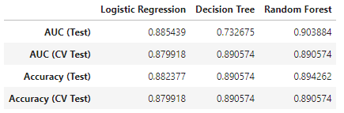

# Online Shoppers Purchasing Intention

Perform EDA and predictions online shoppers' purchasing intention ([UCI ML Repo](https://archive.ics.uci.edu/ml/datasets/Online+Shoppers+Purchasing+Intention+Dataset)) using supervised learning algorithms including logistic regression, decision tree and random forests.

[Project report](https://htmlpreview.github.io/?https://raw.githubusercontent.com/chsueh2/Online_Shoppers_Purchasing_Intention/main/online_shoppers.html)

Key features:

- Exploratory data analysis (EDA)
- Bar plot, Correlation Plot
- Pandas on Spark and Spark SQL
- Cross Validation
- Decision Tree Classifier
- Random Forests Classifier
- Logistic Regression

Modules used:

- `numpy`: Python library used for working with arrays
- `pandas`: data manipulation and analysis. In particular, it offers data structures and operations for manipulating numerical tables and time series.
- `matplotlib.pyplot`: plotting library for creating static, animated, and interactive visualizations
- `pyspark.sql`: Important classes of Spark SQL and DataFrames.
- `pyspark.ml`: DataFrame-based machine learning APIs to let users quickly assemble and configure practical machine learning pipelines.

## Project Report

[Project report](https://htmlpreview.github.io/?https://raw.githubusercontent.com/chsueh2/Online_Shoppers_Purchasing_Intention/main/online_shoppers.html) ([HTML](./online_shoppers.html))

- [Jupyter Notebook：Part 0 - data](./Part0_data.ipynb)
- [Jupyter Notebook：Part 1-3 - analysis](./Part1-3_analysis.ipynb) 
- [Jupyter Notebook：Part 4 - ML models](./Part4_MLv2.ipynb)

The analysis results with theoretical backgrounds are included.

Chien-Lan Hsueh (chienlan.hsueh at gmail.com)

## Overview and Project Goal

Conduct EDA on the training set through spark SQL to get a good understanding of the data structure. This helps identify the useful predictors to be included in the models.

- For numeric variables: inspect collinearity and determine which to include in logistic regression
- For categorical variables: recode the variable if the data distribution is imbalanced

Fit machine learning models including logistic regression and two tree-based classification models (decision tree classifier and random forest classifier) using area under ROC curve as our model selection metric (evaluator).

## Workflow

1. Intro (and data prep)
2. EDA
3. Modeling (3 models)
   - Logistic regression
   - Decision tree
   - Random forest
4. Comparison and Conclusion

